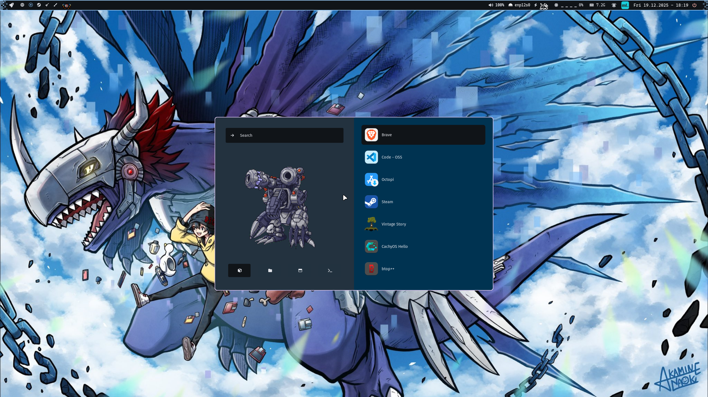
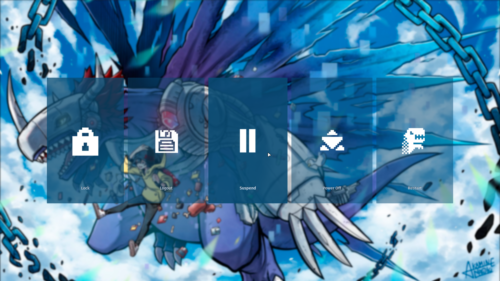
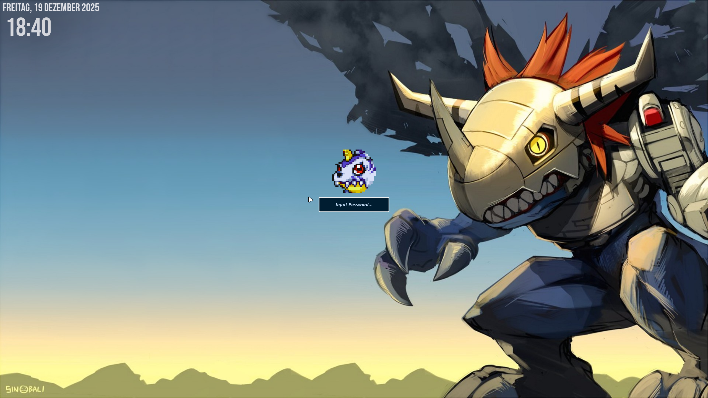

# ML4W Dotfiles for Hyprland

An advanced configuration of Hyprland for Arch Linux based distributions. Full featured desktop environment based on the dynamic tiling window manager Hyprland with adaptive material color themes based on the selected wallpaper for all components. Including a comprehensive selection of apps with the ability to customize the configuration to your personal needs.








## Installation and Documentation

You can find the installation guide and the documentation of the ML4W Dotfiles for Hyprland here:<br><b>https://mylinuxforwork.github.io/dotfiles/</b>

You can install the ML4W Dotfiles for Hyprland with the Dotfiles Installer (Available on Flathub).<br>Click on the badge below to install the app.

<a href="https://mylinuxforwork.github.io/dotfiles-installer/" target="_blank"></a>

Copy the following url into the Dotfiles Installer and start the installation.

#### Stable Release (for Hyprland 0.53.x)

```
https://raw.githubusercontent.com/mylinuxforwork/dotfiles/main/hyprland-dotfiles-stable.dotinst
```
#### Rolling Release (for Hyprland 0.53.x)

```
https://raw.githubusercontent.com/mylinuxforwork/dotfiles/main/hyprland-dotfiles.dotinst
```

#### Stable Release 2.9.9.4 (for Hyprland 0.52.x)

```
https://raw.githubusercontent.com/mylinuxforwork/dotfiles/main/hyprland-dotfiles-stable-hyprland-0.52.dotinst
```

Setup scripts to install the required dependencies are included for <i class="devicon-archlinux-plain"></i> **Arch, <i class="devicon-fedora-plain"></i> Fedora and <i class="devicon-opensuse-plain"></i> openSuse Tumbleweed**.<br>
For other distros, please install <a href="https://mylinuxforwork.github.io/dotfiles/getting-started/dependencies" target="_blank">the dependencies</a> first.

## Special Thanks

I want to say thank you to all contributors of the ML4W Dotfiles and all other Developers who are creating awesome configurations for our favorite Tiling Window Manager Hyprland. Your support, the testing of every version and all your valuable Pull Requests with improvements and bug fixes have repeatedly improved the overall project and increased its relevance and quality.

Special Thanks do to...

https://github.com/Affanmm for the great and professional ML4W Logo Design and much more.
https://github.com/harilvfs for supporting me in creating the new Wiki https://mylinuxforwork.github.io/dotfiles/
https://github.com/dwilliam62 for all your support and testings since the start of the Project
and so many more...

## Inspirations

The following projects have inspired me:

- https://github.com/JaKooLit/Hyprland-Dots
- https://github.com/prasanthrangan/hyprdots
- https://github.com/sudo-harun/dotfiles
- https://github.com/dianaw353/hyprland-configuration-rootfs

and many more...

---

## Install hyprland plugins

- https://github.com/shezdy/hyprsplit
- https://github.com/hyprwm/hyprland-plugins

```bash
hyprpm update
```

```bash
hyprpm add https://github.com/hyprwm/hyprland-plugins
hyprpm add https://github.com/shezdy/hyprsplit
```

### enable plugins

```bash
hyprpm enable hyprsplit
```

## Desktop pets

https://github.com/furudbat/wayland-vpets

  

## Resources and Wallpapers

- https://digimon.fandom.com/wiki/DigiCode
- https://www.artstation.com/neocity222
- https://danbooru.donmai.us/posts/2113430
- https://danbooru.donmai.us/posts/2255142
- https://x.com/rastadog77/status/1713937342728433946
- https://www.artstation.com/sinobali
- https://x.com/bixclowart/status/1891526837957709948
- https://x.com/Akamine_Naoki/status/1800832906853752899
