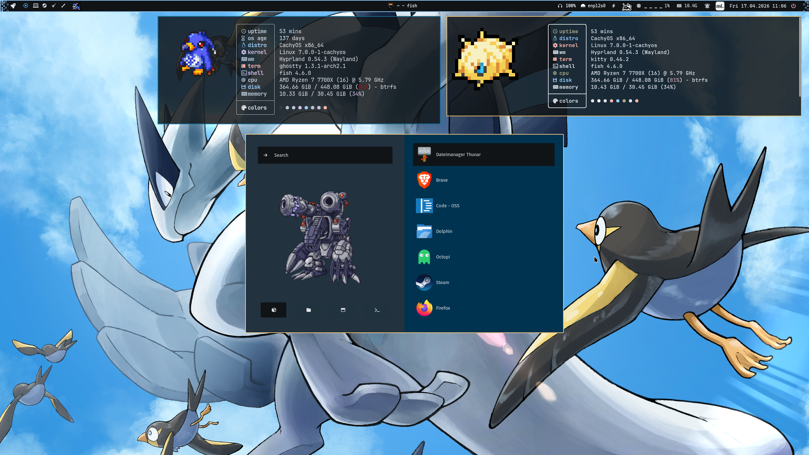
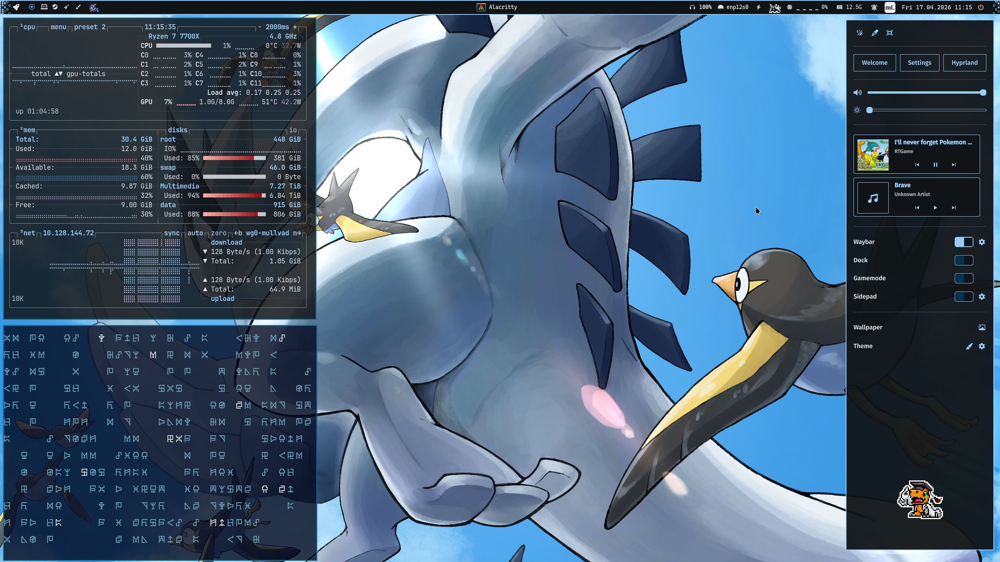

# ML4W OS - Dotfiles for Hyprland

An advanced configuration of Hyprland for Arch Linux based distributions. Full featured desktop environment based on the dynamic tiling window manager Hyprland with adaptive material color themes based on the selected wallpaper for all components. Including a comprehensive selection of apps with the ability to customize the configuration to your personal needs.

PLEASE NOTE: The ML4W OS 2.13.0 has been updated to the new Hyprland lua configuration. Issues and bugs can occur. 

Known Issues: 
- Click on numbers on waybar will not change the workspace. Waybar update is needed (already announced). Please use the key binding SUPER+x instead.





## Installation and Documentation

You can find all installation options in the documentation of the ML4W OS for Hyprland here:<br><b>https://ml4w.com/os/</b>

### Quick Installation

Copy one of the following commands into your terminal:

```sh
bash <(curl -s https://ml4w.com/os/stable) # Stable Release
```

```sh
bash <(curl -s https://ml4w.com/os/rolling) # Rolling Release (only Hyprland 0.55.x)
```
Arch, Fedora and openSuse Tumblweed are directly supported.

### Test and install with the ML4W OS Live ISO

> Currently only available with ML4W OS 2.12.2. Will be updated very soon to 2.13.0

Test the ML4W OS without risk on your computer or in a Virtual Machine with the ML4W Live ISO.

<a href="https://ml4w.com/iso/ml4w-os/ml4w-os-2.12.0-x86_64.iso">Download the ML4W ISO</a>

You can install the ML4W OS on your hard drive with the command `sudo install-ml4w-os` (BETA).

## Special Thanks

I want to say thank you to all contributors of the ML4W OS and all other Developers who are creating awesome configurations for our favorite Tiling Window Manager Hyprland. Your support, the testing of every version and all your valuable Pull Requests with improvements and bug fixes have repeatedly improved the overall project and increased its relevance and quality.

Special Thanks do to...

https://github.com/Affanmm for the great and professional ML4W Logo Design and much more.
https://github.com/harilvfs for supporting me in creating the new Wiki https://ml4w.com/os/
https://github.com/dwilliam62 for all your support and testings since the start of the Project
and so many more...

## Inspirations

The following projects have inspired me:

- https://github.com/JaKooLit/Hyprland-Dots
- https://github.com/prasanthrangan/hyprdots
- https://github.com/sudo-harun/dotfiles
- https://github.com/dianaw353/hyprland-configuration-rootfs
- https://github.com/basecamp/omarchy
- https://github.com/end-4/dots-hyprland

and many more...

---

## Update Plugins

```bash
hyprpm update
git subtree pull --prefix=dotfiles/.config/hypr/hyprsplit https://github.com/shezdy/hyprsplit.git main --squash
hyprctl reload
```

## Desktop pets

https://github.com/furudbat/wayland-vpets

  

## Stow

```bash
stow -d ./ -t ~/ dotfiles
```

## Resources and Wallpapers

- https://digimon.fandom.com/wiki/DigiCode
- https://www.artstation.com/neocity222
- https://danbooru.donmai.us/posts/2113430
- https://danbooru.donmai.us/posts/2255142
- https://x.com/rastadog77/status/1713937342728433946
- https://www.artstation.com/sinobali
- https://x.com/bixclowart/status/1891526837957709948
- https://x.com/Akamine_Naoki/status/1800832906853752899
- https://www.pixiv.net/en/users/33749051
